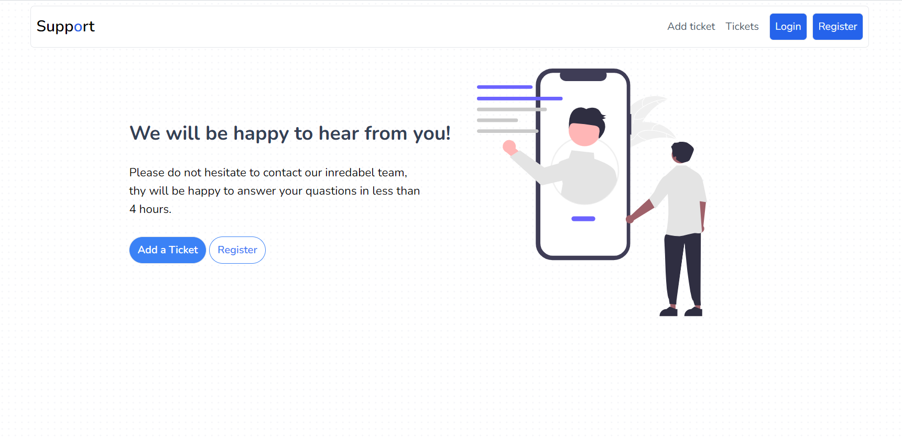
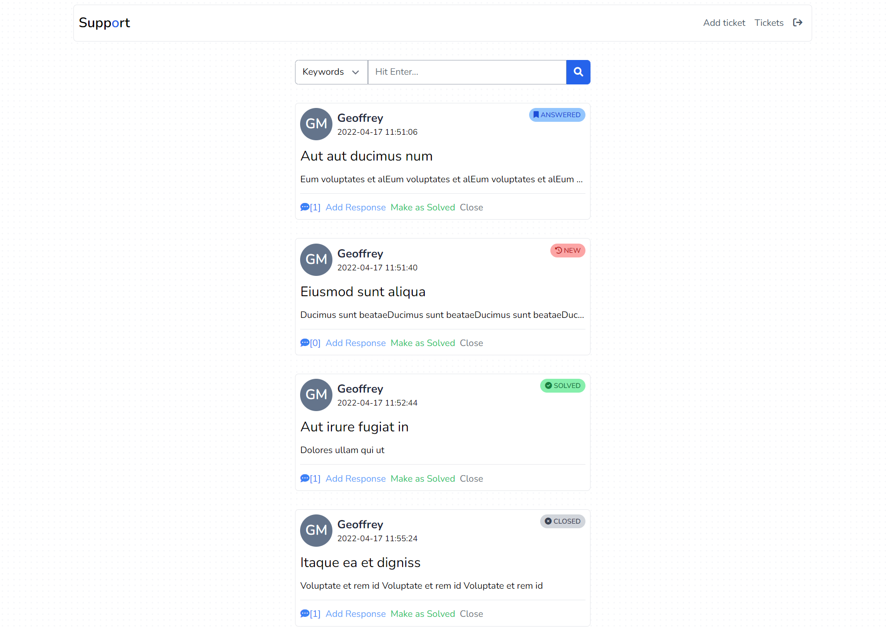
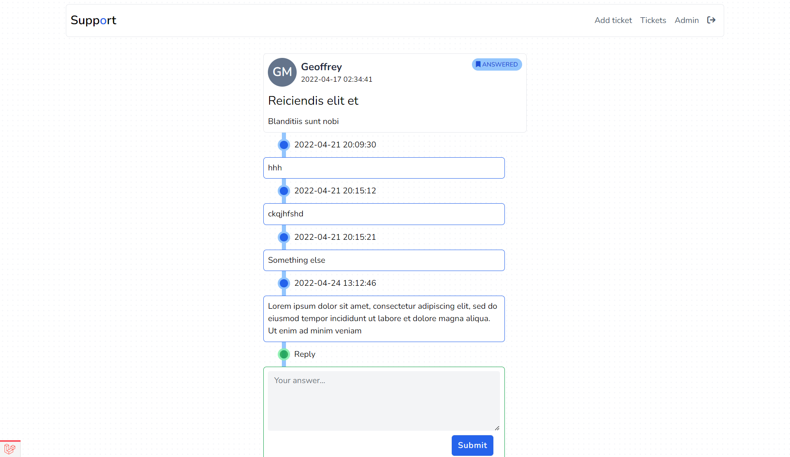
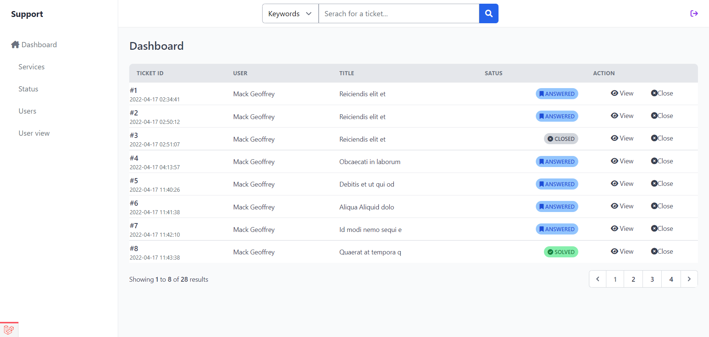
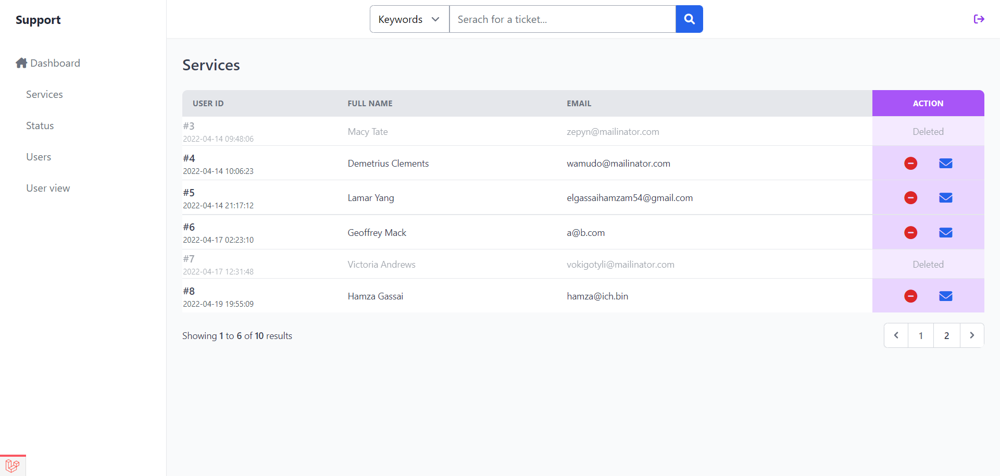
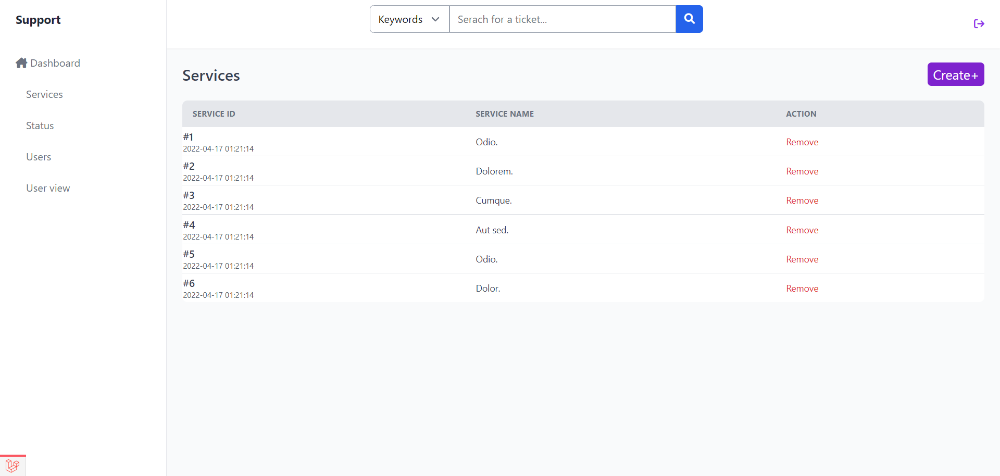

# Table of Contents
- [Table of Contents](#table-of-contents)
  - [About support](#about-support)
  - [Technologies](#technologies)
    - [Front-end:](#front-end)
    - [Back-end:](#back-end)
- [Screenshots](#screenshots)
  - [Front-office](#front-office)
  - [Back-office](#back-office)

## About support

Support is a web application that allows users and admins to create tickets and track their status (answered, closed, etc.).

## Technologies

### Front-end: 

* HTML5 - CSS - [Tailwindcss](https://tailwindcss.com/)
* [Fontawesome](https://fontawesome.com/)

### Back-end:

* PHP - [Laravel](https://laravel.com)
* MySQL

# Screenshots

## Front-office

* ### Landing page

* ### Tickets page

* ### Answers page

## Back-office

* ### Show ticket

* ### Show Users

* ### Show Services

